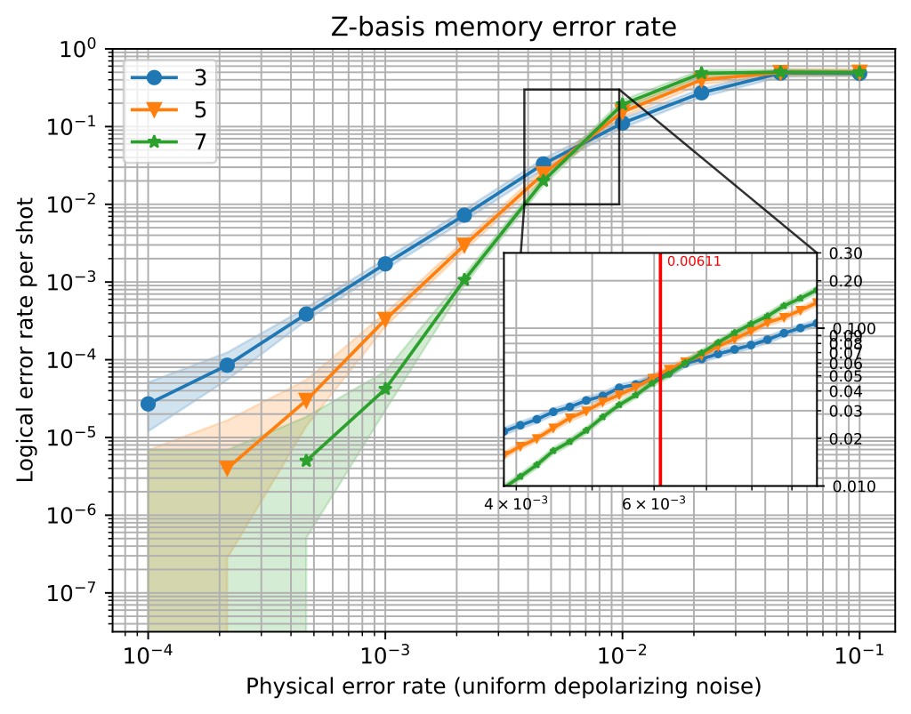

Detailed plots with :code:`tqec`
================================

The :code:`tqec` library provides tools to create detailed plots of the results obtained with :code:`sinter`. Below is an example of the type of plots you can generate
with :code:`tqec`.

   A detailed plot of the memory experiment with d = 3, 5 or 7 and an inset plot for threshold information

This notebook will guide you through the process of creating such a plot for a basic memory experiment.

1. Create the computation
--------------------------

The first step of any plot is to create the quantum computation that will be used to generate the plots. In our case, this is a memory experiment.

.. jupyter-execute::

    from tqec.gallery.memory import memory
    from tqec.utils.enums import Basis

    block_graph = memory(Basis.Z)
    observables = block_graph.find_correlation_surfaces()

2. Perform the simulations
--------------------------

Then, we need to perform multiple simulation to gather statistics to plot.

This gathering stage is split in 3 parts:

1. Computing general statistics over a large range of physical error-rate (e.g., :math:`p \in [10^{-4}, 10^{-1}]`),
2. Computing an estimate of the threshold :math:`p_\text{thres}`` under which increasing the code distance corrects more errors,
3. Computing fine statistics around the computed threshold.

First, define the parameters of our simulation.

.. jupyter-execute::

    import numpy
    import sinter

    from tqec.compile.convention import FIXED_BULK_CONVENTION

    # Define the values of k (scaling factor) and p (physical error-rate) for which
    # we want data points.
    ks = list(range(1, 4))
    ps = list(numpy.logspace(-4, -1, 10))

    # Only use a low number of shots for demonstration purposes.
    max_shots = 1_000_000
    max_errors = 500

    # All the data will be collected observable per observable, let's have
    # data-structures to store the results
    main_statistics: list[list[sinter.TaskStats]] = []
    thresholds: list[float] = []
    threshold_statistics: list[list[sinter.TaskStats]] = []

2.1. Gathering general statistics
^^^^^^^^^^^^^^^^^^^^^^^^^^^^^^^^^

This part should be quite familiar if you already used the :code:`tqec.simulation` module.

.. jupyter-execute::

    from tqec.simulation.simulation import start_simulation_using_sinter
    from tqec.utils.noise_model import NoiseModel

    for i, obs in enumerate(observables):
        stats = start_simulation_using_sinter(
            block_graph,
            range(1, 4),
            list(numpy.logspace(-4, -1, 10)),
            NoiseModel.uniform_depolarizing,
            manhattan_radius=2,
            convention=FIXED_BULK_CONVENTION,
            observables=[obs],
            max_shots=max_shots,
            max_errors=max_errors,
            decoders=["pymatching"],
            split_observable_stats=False,
        )
        main_statistics.append(stats[0])

2.2. Estimating the threshold
^^^^^^^^^^^^^^^^^^^^^^^^^^^^^^

The next step will be to have a good-enough estimation of the provided computation threshold. This threshold will help us calibrating the next step
where we perform more sampling around the estimated threshold value to have a detailed view of the code behaviour near its threshold.

.. jupyter-execute::

    from math import log10

    from tqec.simulation.threshold import binary_search_threshold

    for obs in observables:
        threshold, _ = binary_search_threshold(
            block_graph,
            obs,
            NoiseModel.uniform_depolarizing,
            manhattan_radius=2,
            minp=10**-5,
            maxp=0.1,
            convention=FIXED_BULK_CONVENTION,
            max_shots=max_shots,
            max_errors=max_errors,
            decoders=["pymatching"],
        )
        thresholds.append(threshold)

    log10_thresholds = [log10(t) for t in thresholds]
    mint, maxt = min(log10_thresholds), max(log10_thresholds)
    log10_threshold_bounds = (mint - 0.2, maxt + 0.2)

2.3. Gathering statistics around the threshold
-----------------------------------------------

Now that we have a good estimation of the computation threshold, we can gather statistics around it.

.. jupyter-execute::

    from multiprocessing import cpu_count
    from pathlib import Path

    for obs in observables:
        threshold_stats = start_simulation_using_sinter(
            block_graph,
            ks,
            list(numpy.logspace(*log10_threshold_bounds, 20)),
            NoiseModel.uniform_depolarizing,
            manhattan_radius=2,
            convention=FIXED_BULK_CONVENTION,
            observables=[obs],
            num_workers=cpu_count(),
            max_shots=10_000_000,
            max_errors=5_000,
            decoders=["pymatching"],
            split_observable_stats=False,
            save_resume_filepath=Path(f"./_examples_database/detailed_plots_z.csv"),
        )
        threshold_statistics.append(threshold_stats[0])

3. Plot
-------

All the statistics we need should now be computed. Let's plot!

.. jupyter-execute::

    %matplotlib inline
    import matplotlib.pyplot as plt

    from tqec.simulation.plotting.inset import plot_threshold_as_inset

    zx_graph = block_graph.to_zx_graph()

    for i, obs in enumerate(observables):
        main_stats = main_statistics[i]
        threshold = thresholds[i]
        thres_stats = threshold_statistics[i]

        fig, ax = plt.subplots()
        sinter.plot_error_rate(
            ax=ax,
            stats=main_stats,
            x_func=lambda stat: stat.json_metadata["p"],
            group_func=lambda stat: stat.json_metadata["d"],
        )
        xmin = 10 ** log10_threshold_bounds[0]
        xmax = 10 ** log10_threshold_bounds[1]
        # Note: the below values require prior knowledge about the values to look
        # for on the Y-axis.
        ymin, ymax = 1e-2, 3e-1
        plot_threshold_as_inset(
            ax,
            thres_stats,
            # Note: ymax is **before** ymin because the y axis is inversed.
            zoom_bounds=(xmin, ymax, xmax, ymin),
            threshold=threshold,
            inset_bounds=(0.5, 0.25, 0.4, 0.4),
        )
        ax.grid(which="both", axis="both")
        ax.legend()
        ax.loglog()
        ax.set_title("Z-basis memory error rate")
        ax.set_xlabel("Physical error rate (uniform depolarizing noise)")
        ax.set_ylabel("Logical error rate per shot")
        ax.set_ylim(10**-7.5, 10**0)
