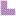
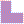
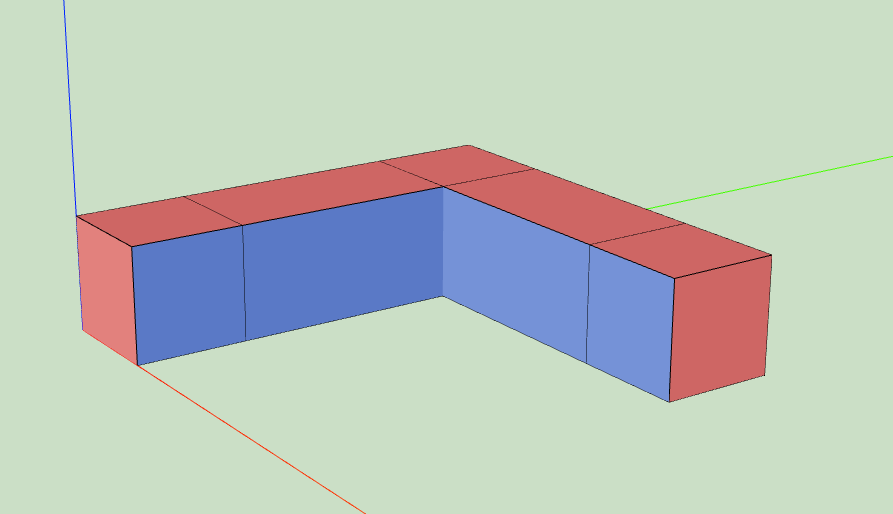
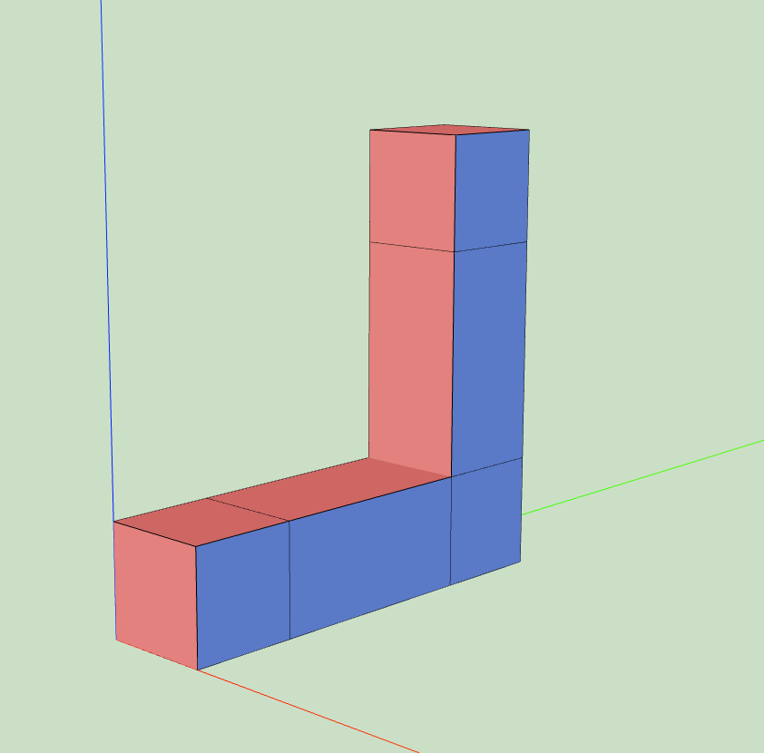
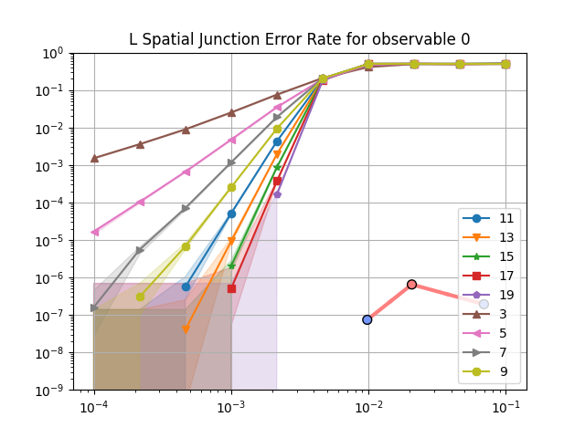
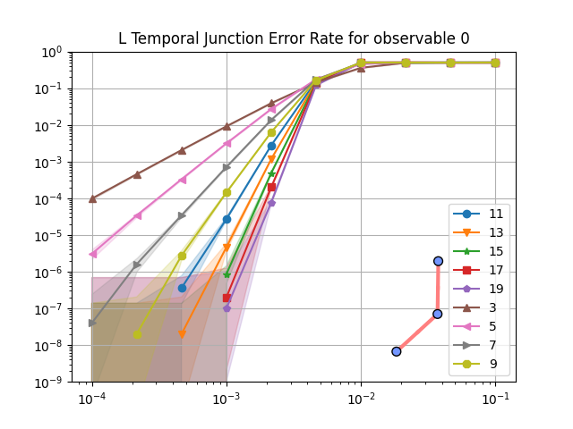
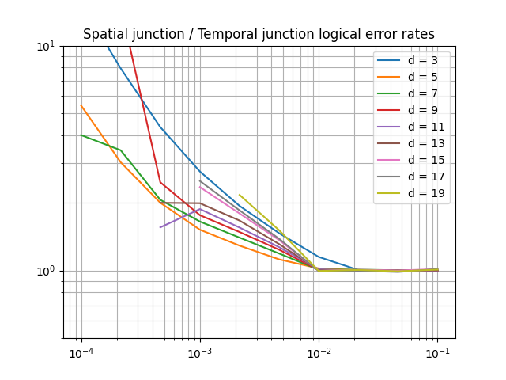

.. _extendedstabilizersimplementation:

Extended plaquettes implementation
===================================

When are extended plaquettes used?
-----------------------------------

Extended plaquettes are used in fixed boundary convention when implementing some spatial junctions.

These plaquettes are needed to keep the fixed boundary convention.

What is temporal alternation?
-----------------------------

Extended plaquettes are vulnerable to **hook errors**: a single fault on an ancilla
qubit that propagates to multiple data qubits through the stabilizer
measurement circuit. In the surface code, this occurs when a fault on a
measurement qubit spreads to two data qubits via a CNOT gate, creating a
weight-2 error that can match a detector pair. If these hook
errors are left uncontrolled, they can form undetectable logical errors
and significantly reduce the effective code distance. Fully controlling
them would require even more moments, which would increase the number of
idle moments for regular plaquettes and introduce more errors.

Instead, the fixed boundary convention uses **temporal alternation**:
consecutive QEC rounds alternate between a forward and a backward plaquette
schedule. The backward schedule reverses the order of CNOT gates, flipping
the orientation of hook errors from one round to the next. This prevents
low-weight hook errors from lining up across rounds to form undetectable
logical errors :footcite:`Gidney_alternating_2025, Shaw_Terhal_2026`.
Temporal alternation requires undetectable logical errors to come from a
length **d-1** Pauli error chain. This is an increase in circuit distance
compared to a non-alternating extended plaquette measurement schedule,
which can corrupt the logical qubit via a hook error mechanism created by
Pauli errors on as low as ⌈d/2⌉ physical qubits.

When a spatial junction is present, the usual ``Init -> Rep(memory) -> Meas``
pattern is replaced by a sequence that alternates backward and forward memory
plaquettes, with the total number of repetitions unchanged.

For the implementation, see the ``is_reversed`` parameter in
``src/tqec/compile/specs/library/generators/extended_stabilizers.py``
and the forward/backward schedule alternation in
``src/tqec/compile/specs/library/fixed_boundary.py``.

Note that while temporal alternation preserves the circuit-level
distance, this does not guarantee better logical performance at all physical
error rates, since the logical performance also depends on the number of
minimum-weight and near-minimum-weight error mechanisms that can occur
:footcite:`Shaw_Terhal_2026`.

What are the implications of using extended plaquettes?
--------------------------------------------------------

Longer QEC rounds
~~~~~~~~~~~~~~~~~

The current implementation of extended plaquettes (shown below) requires 8 moments, instead of only
6 moments for regular plaquettes.

.. raw:: html

    <iframe title="Implementation of the Z-basis extended plaquette." width=100% height=650px src="https://algassert.com/crumble#circuit=Q(-1,-1)0;Q(-1,1)1;Q(-1,3)2;Q(0,0)3;Q(0,2)4;Q(1,-1)5;Q(1,3)6;R_1;RX_3;TICK;CX_3_1;R_4;TICK;CX_1_4;CZ_3_0;TICK;CZ_4_2;TICK;CZ_3_5;TICK;CX_1_3;CZ_4_6;TICK;CX_4_1;TICK;MX_4"></iframe>

That means that the quantum circuit implementing a QEC experiment with a spatial junction will have
idle moments, due to the need for regular plaquettes to wait 2 moments at each QEC rounds to
synchronise with the extended plaquette.

In turns, more idle moments means more opportunity for physical errors, which might increase the final
logical error-rate.

Smaller distance
~~~~~~~~~~~~~~~~

Controlling the orientation of hook errors in extended plaquettes is way more costly than in
regular ones. Due to the already high number of moments needed to implement extended plaquette,
the cost of controlling hook errors becomes prohibitive in terms of number of moments needed (which
directly translates to number of idle moments for regular plaquettes, and so more errors).

Instead, hook errors are left as-is and schedules of extended plaquettes are alternated.

It turns out that using this technique does not remove all low-weights errors. For example, for a
very simple computation, here is an image showing a weight-5 undetectable logical error on a
surface code that is supposed to have a distance of 7.

   Visualisation of a weight-5 error that is undetectable (because each detectors involved are
   triggered by 2 errors, which means that they will not raise any detection event) and that changes
   the logical observable. Each error is visualised with a cross. The cross colour follows the
   XYZ=RGB convention, and the moment index at which the error takes place is written above the
   cross (an error is always scheduled at the end of the moment, so any operation applied at the
   same moment is applied before the error).

The same error pattern can be observed for higher distances:

   Visualisation of a weight-7 error that is undetectable (because each detectors involved are
   triggered by 2 errors, which means that they will not raise any detection event) and that changes
   the logical observable.

In theory, this seems to be a huge problem as the implementation of extended plaquettes reduces distance
of the code. But in practice, it turns out that this is not a big issue. To show that, we need to compare
the logical error-rate of a computation that uses extended plaquettes with a similar computation that
does not. For the sake of simplicity, we compare the simplest computation involving a spatial
junction with its rotated counterpart.

.. See https://stackoverflow.com/a/42522042

|spatial_junction| |temporal_junction|

The logical error rates computed can be seen below:

.. note::

   See :ref:`reading_error_plots` for help reading logical error-rate plots like the ones
   above.

To compare these logical error rates, it is interesting to plot their ratio for each physical error
rates and distances. This is done below with the ratio of the logical error rate obtained on the
spatial junction (containing extended plaquettes) and the one obtained on temporal junctions (without
extended plaquettes).

   Ratio between the logical error rates for the spatial junction and temporal junction.

As expected, the use of extended plaquettes leads to a worse logical error rate. But the numbers
matter here! For example, for a physical error rate of 10⁻³, increasing the distance on the temporal
junction reduces the logical error rate by ~8. For the same physical error rate, and for distances up
to 17, the above plot shows that the spatial junction (using extended plaquette) logical error
rate is never higher than 3 times its temporal counterpart.

That means that, in practice, using extended plaquettes have a noticeable effect on logical error
rate **but** that effect is not as bad as it seems. In fact, the number of low-weight logical errors
is small enough that the code still persists good performance in terms of logical error rate.

References
-----------
.. footbibliography::
