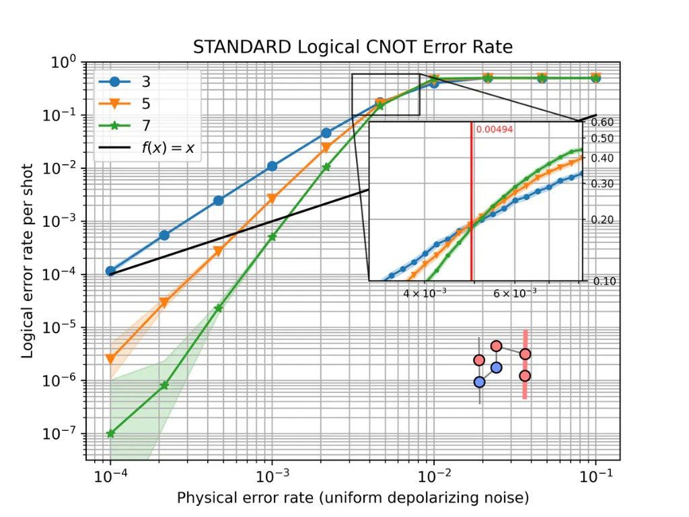

.. _reading_error_plots:

Reading logical error-rate plots
================================

The gallery and several user-guide notebooks plot the **logical error rate** of a
computation as a function of the physical error rate and the code distance. This page
explains how to read those plots.

The example below comes from the :doc:`quick_start` guide. The same reading applies to
memory experiments, Steane encoding, and the other gallery notebooks. For background on
thresholds and distance scaling, see :ref:`surface_codes`.

   Logical CNOT error rate at distances :math:`d \in \{3, 5, 7\}` under uniform
   depolarizing noise.

The axes
--------

The **physical error rate** on the horizontal axis is the noise strength :math:`p`
applied to the compiled ``stim`` circuit. Most examples use
:meth:`~tqec.utils.noise_model.NoiseModel.uniform_depolarizing`, but any noise model
parameterized by a single rate :math:`p` can be plotted the same way.

The **logical error rate** on the vertical axis is the estimated probability that one shot of the
full experiment ends with a wrong decoded outcome for the observable under study. Both
axes use a logarithmic scale.

By default, ``sinter.plot_error_rate`` reports this rate **per shot**. Several gallery
notebooks instead pass ``failure_units_per_shot_func=lambda stat: stat.json_metadata["d"]``,
which rescales the axis to an approximation of the logical error rate **per QEC round** (check the y-axis
label on the plot you are reading). The example at the top of this page is per shot.

Each curve corresponds to one **code distance** :math:`d`. In ``tqec``, distances are
generated from the scaling parameter :math:`k` by :math:`d = 2k + 1`.

The inset
---------

The :doc:`quick_start` guide and gallery notebooks usually include a small ZX graph in
a corner. It shows the computation that was simulated and the logical observable the
curve refers to. Other pages may show static figures instead, or a threshold zoom inset
as in :doc:`detailed_plots`, rather than this ZX diagram.

The graph is the spacetime diagram of the ``BlockGraph``, obtained with
:code:`block_graph.to_zx_graph()`. **Red** nodes are :math:`X`-type spiders and **blue**
nodes are :math:`Z`-type spiders, as elsewhere in ``tqec`` (see
:ref:`Correlation Surface <terminology>`).

The thick highlighted edges trace a :ref:`correlation surface <terminology>`: the
measurements whose parity tracks how a logical operator is transformed from input to
output. The surface shown is the one passed to
:func:`~tqec.simulation.simulation.start_simulation_using_sinter`. If you change the
observable or the computation, both the inset and the curves change.

The inset is drawn by :func:`~tqec.simulation.plotting.inset.plot_observable_as_inset`.

How the points are computed
---------------------------

Each marker is estimated from many independent shots. For each pair :math:`(d, p)`:

1. The ``BlockGraph`` is compiled and, for each value of :math:`k`, exported to a
   noiseless ``stim`` circuit with detectors and logical observables.
2. Noise at rate :math:`p` is injected through the chosen noise-model factory.
3. ``stim`` simulates the circuit and records detector syndromes and logical outcomes.
4. A decoder (typically ``pymatching``) predicts the logical bit from the syndromes.
5. A mismatch with the expected value counts as one logical error.
6. The logical error rate is estimated from the fraction of shots where the decoder returned
   an invalid result, together with uncertainty bounds (reported per shot or per round
   depending on how the plot is configured).

In code this is handled by
:func:`~tqec.simulation.simulation.start_simulation_using_sinter`, which builds tasks
with :func:`~tqec.simulation.generation.generate_sinter_tasks` and collects statistics
via ``sinter``. Sampling stops when ``max_shots`` and/or ``max_errors`` is reached,
which is one reason some low-noise points may be missing (see
:ref:`Confidence intervals and missing points <error_plot_confidence>`).

Below and above threshold
-------------------------

Every QEC code has an **error threshold** :math:`p_\text{th}`: a physical error rate
below which increasing the distance suppresses the logical error rate, and above which
error correction fails. The surface-code scaling law is discussed on the
:ref:`surface_codes` page.

On a typical plot, three regimes are visible:

**Below threshold** — at low :math:`p`, curves for larger :math:`d` lie lower. On a
log–log plot they often look like straight lines.

**Above threshold** — at high :math:`p`, all curves converge toward a logical error
rate near :math:`1/2`. Increasing :math:`d` no longer helps.

**Near the crossing** — where curves for different distances meet gives a rough visual
estimate of :math:`p_\text{th}` for that computation and noise model. For a more precise
value, use :func:`~tqec.simulation.threshold.binary_search_threshold` as in
:doc:`detailed_plots`.

The numeric ranges mentioned above depend on the example. The CNOT plot at the top of
this page crosses near :math:`p \sim 10^{-2}`; your computation may differ.

The slope below threshold
~~~~~~~~~~~~~~~~~~~~~~~~~

Below threshold, the most useful feature is the **slope of each curve on the log–log
plot**. A steeper slope means that increasing :math:`d` suppresses logical errors faster
as :math:`p` is reduced.

Near threshold, a common rule of thumb (see :ref:`surface_codes`) is

.. math::

   p_L \;\propto\; \left(\frac{p}{p_\text{th}}\right)^{\lfloor (d+1)/2 \rfloor}

When comparing two implementations, check both the vertical separation at fixed
:math:`p` and whether the slopes match. A constant vertical shift with the same slope
suggests overhead; different slopes suggest a change in effective distance or a bug in
the implementation.

Error suppression factor :math:`\Lambda`
~~~~~~~~~~~~~~~~~~~~~~~~~~~~~~~~~~~~~~~~

The **error suppression factor** :math:`\Lambda` measures how much the logical error
rate drops when the distance increases. One practical estimate at fixed :math:`p`
below threshold is

.. math::

   \Lambda \;\approx\; \frac{p_L(d)}{p_L(d')}

for :math:`d' = d+2` at the same :math:`p` below threshold
(so :math:`\Lambda > 1` when suppression improves with distance). Values close to what
the power-law scaling above predicts
indicate healthy surface-code-like behaviour. A much smaller :math:`\Lambda` suggests
extra failure mechanisms — boundary effects, hook errors, or decoder limitations — that
reduce the expected suppression.

This matters for resource estimation: knowing how fast :math:`p_L` falls with :math:`d`
tells you how large a code is needed at a given hardware error rate.

Pseudo-threshold
~~~~~~~~~~~~~~~~

The **pseudo-threshold** is the physical error rate at which the logical error rate for
a single distance crosses a chosen reference (often :math:`p_L = 0.5`, or the point
where two adjacent curves cross). Unlike :math:`p_\text{th}`, it depends on :math:`d`
and on how many QEC rounds the circuit performs.

Treat it as a quick visual guide only. To argue that a computation is below threshold,
compare curves across several distances or run a dedicated threshold search.

.. _error_plot_confidence:

Confidence intervals and missing points
---------------------------------------

The shaded bands are **confidence regions** for the binomial parameter being plotted on
the y-axis (per shot or per round). They are not symmetric Gaussian error bars.

``sinter.plot_error_rate`` uses :code:`sinter.fit_binomial`, which includes all rates
whose likelihood is within a factor :code:`max_likelihood_factor` of the
maximum-likelihood estimate. Because the logical error rate lies in :math:`[0, 1]`, the
intervals are naturally asymmetric, especially near :math:`0` and :math:`1/2`.

**Wide bands at low** :math:`p` usually mean that few logical errors were observed
before sampling stopped. Estimating a rate of :math:`10^{-6}` with tight bounds requires
either a very large number of shots or stopping only after many errors; with modest
``max_errors``, little data is collected on the left side of the plot.

**Missing markers** on the low-noise side of a plot typically mean that no logical
errors were recorded (:code:`errors == 0`), so ``sinter.plot_error_rate`` omits the
point, or that the corresponding simulation task did not finish. The CNOT example at
the top of this page is missing the :math:`d = 7` point at :math:`p = 10^{-4}` for this
reason. Increasing ``max_shots``, ``max_errors``, or reusing a ``save_resume_filepath``
fills in the left side of the plot at the cost of longer runs.

You might occasionally see **duplicate markers** at the same :math:`p`; this is a known
plotting artifact tracked in `issue #825 <https://github.com/tqec/tqec/issues/825>`_.
