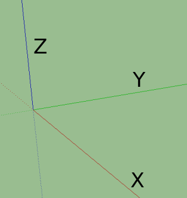

.. _terminology:

Terminology
===========

This page provides definitions for some important terms used in the ``tqec`` codebase.
Also, we highlight and expand on some concepts that can not fit in the :ref:`API Reference <api>`.

.. _block:

Block
-----

Represents quantum operations that encode some logical properties and are local in spacetime.
The quantum operations within the block are carefully designed to map logical observables correctly in spacetime.
At the same time, these operations generate syndrome information that prevents the circuit distance from being degraded due to physical error chains, ensuring fault tolerance.

By composing blocks, we can construct the desired mappings between logical operators
while preserving the protection of the logical information.
This is the essence of fault-tolerant quantum computation.

In ``tqec``, a block is either a :ref:`Cube <cube>` or a :ref:`Pipe <pipe>`.

The naming convention for a cube or a pipe is as follows:

- The axes used for labeling are as shown in the figure below. ``RGB`` axes are synonymous to ``XYZ`` axes.
- We begin by labeling the boundary that is facing the X-axis first, then the one that is facing the Y-axis followed by the one facing the Z-axis.

   X, Y, Z axes

The labels based on color of the boundaries are provided in the table below.

.. list-table::
   :header-rows: 1
   :align: center

   * - Color
     - Boundary
   * - Red Wall
     - X
   * - Green Half-Cube
     - Y
   * - Blue Wall
     - Z
   * - Yellow band
     - H
   * - Open/Hole (no color)
     - O

.. _cube:

Cube
----

Represents the fundamental building :ref:`block <block>` that occupies certain spacetime volume. The kind of cube determines the
quantum operations that are applied within the cube. Currently we have the following kinds of cubes, and more cubes can be added in the future:

.. figure:: ../media/user_guide/terminology/cubes.png
   :width: 400px
   :align: center

   Different kinds of cubes

.. _zxcube:

:py:class:`~tqec.computation.ZXCube`
~~~~~~~~~~~~~~~~~~~~~~~~~~~~~~~~~~~~

A cube whose faces are of ``X`` (red) or ``Z`` (blue) type. We assume each pair of opposite faces are of the same type.
Then the kind can be specified by the type of the faces looking from the XYZ directions. For example, the ``ZXZ`` cube in the
figure above has ``Z`` type faces along the X direction, ``X`` type faces along the Y direction, and ``Z`` type faces along the Z direction.

A ``ZXCube`` occupies :math:`\approx d^3` spacetime volume, where :math:`d` is the code distance.

Note that ``ZXZ``, ``XZZ``, ``ZXX`` and ``XZX`` cubes can represent a (trivial) logical computation by themselves, i.e. a logical memory experiment.
For example, the ``XZX`` cube can be used to represent a logical qubit with ``Z``/``X`` boundaries parallel to the X/Y axes. And the time boundary
is of ``X`` type, which means that the logical qubit is initialized and measured in the logical ``X`` basis.

Spatial Cube
++++++++++++++++

Unlike the other ``ZXCube``, ``XXZ`` and ``ZZX`` cubes have all the spatial boundaries in the same basis. These cubes cannot connect to temporal pipes.
When connected with two or more spatial pipes, they form **spatial junctions**:

.. figure:: ../media/user_guide/terminology/spatial_junctions.png
   :width: 450px
   :align: center

   Spatial junctions

The circuits that implement these spatial cubes are more complex than the circuits for the other cubes, and special care needs to be taken to avoid
the hook errors from decreasing the circuit-level code distance.

:py:class:`~tqec.computation.YHalfCube`
~~~~~~~~~~~~~~~~~~~~~~~~~~~~~~~~~~~~~~~

A green cube representing inplace Y-basis logical initialization or measurement as proposed in `this paper <https://quantum-journal.org/papers/q-2024-04-08-1310/>`_.
The cube's function, whether for initialization or measurement, is determined by its connection to other cubes, either upwards or downwards.

A ``YHalfCube`` occupies :math:`\approx d^3 /2` spacetime volume, where :math:`d` is the code distance.

:py:class:`~tqec.computation.Port`
~~~~~~~~~~~~~~~~~~~~~~~~~~~~~~~~~~

A port is a special type of cube that represents the input or output of a logical computation.
It functions as a virtual cube, serving only as a placeholder for other sources or sinks of logical information.
Therefore, ports are not visualized in spacetime diagrams and occupy zero spacetime volume.

.. _pipe:

Pipe
----

Represents the :ref:`block <block>` that maps logical operators between different :ref:`cubes <cube>`.
There are various types of pipes based on the boundary types and connection direction. Additionally,
Hadamard transitions may occur in the pipe, which changes the basis of the logical operator passing through it.

.. figure:: ../media/user_guide/terminology/pipes.png
   :width: 500px
   :align: center

   Different types of pipes

**It's important to note that the pipe does not occupy spacetime volume by itself.**
Instead, the operations within the pipe replace the operations in the cubes it connects.
The pipe’s visual representation in the diagram is exaggerated for clarity.

.. figure:: ../media/user_guide/terminology/pipe_connects_cubes.png
   :width: 400px
   :align: center

   Example of pipes connecting cubes

Each cube in the figure above should initially be thought of as an

.. math::

   InitZ_k \rightarrow (2k − 1) \times Mem_k \rightarrow MeasZ_k

memory experiment. The pipes modify the walls of these experiments. The first vertical pipe should be interpreted as a layer of memory circuit :math:`Mem_k`.
It replaces :math:`MeasZ_k` in the bottom cube and :math:`InitZ_k` in the top cube with :math:`Mem_k` layers.
The horizontal pipe replaces the boundary walls of the two cubes it touches with connecting stabilizer measurements, along with appropriate data qubit initialization and measurement.

.. _correlation_surface:

Correlation Surface
-------------------

A correlation surface is a product of stabilizers which establish a mapping from the input logical operator to the output logical operator of a surface code computation. The mapping implements the desired logical computation up to some sign depending on the parity of the physical initialization, measurements and stabilizer measurements included in the correlation surface. Just as surface code :ref:`plaquettes <plaquette>` are stabilizers of the data of individual physical qubits, correlation surfaces are stabilizers of computational paths (oftentimes trees) experienced by data qubits in spacetime.

Correlation surfaces are useful to track the movement of data.  A logical observable is a set of measurements whose value corresponds to the outcome of measuring a logical operator. In ``tqec``, we assume all the qubits are initialized to the +1 eigenstate of logical operators. Therefore, the sign is determined by the parity of a joint Pauli product measurement induced by a correlation surface. The ``tqec`` software package determines the reliability of a computation's structure by transforming the correlation surfaces that it supports into a list of physical measurements and emitting the list as ``OBSERVABLE_INCLUDE`` instructions in a ``Stim`` circuit which may be sampled from.

Here we take the movement of a logical qubit for example:

.. figure:: ../media/user_guide/terminology/logical_qubit_movement.png
   :width: 600px
   :align: center

   Movement of a logical qubit

The movement operation maps :math:`Z_L, X_L` logical operators at input to :math:`Z_L^{\prime}, X_L^{\prime}` at output.
Firstly, we show in detail why the structure and circuits above implement the movement of a logical qubit.

a. All data qubits initialized to :math:`|0\rangle`.
b. :math:`2k + 1` rounds of stabilizer measurement.
c. Beginning to extend the logical qubit with more data qubits initialized to :math:`|0\rangle`. Black dots represent data qubits doing nothing.
   :math:`Z_L` can be extended without sign change across these :math:`|0\rangle` values.
d. :math:`2k + 1` rounds of stabilizer measurement during which stabilizers indicated with red dots are used to move :math:`X_L`.
   The parity of any chosen round of these measurements sets a sign relationship between :math:`X_L` and :math:`X_L^{\prime}`.
   Our convention is to choose the earliest round.
e. :math:`Z` basis measurement of data qubits. The parity of the blue highlighted raw values sets
   a sign relationship between :math:`Z_L` and :math:`Z_L^{\prime}`.

Note that the sign relationship described above depends on the measurement outcomes, which are error-prone and need
error correction.

Tracking the process of logical operator movement above, we can get the following two correlation surfaces:

.. figure:: ../media/user_guide/terminology/correlation_surface.png
   :width: 200px
   :align: center

   Correlation surfaces, red for X and blue for Z

You can think of constructing the correlation surface as moving a line of logical operators through the structure,
only allowing the logical operators to attach to walls with the same basis.

Related concepts
~~~~~~~~~~~~~~~~

A set of measurements with predictable parity in the absence of errors is called a :ref:`detector <detector>`. The detecting regions highlighted in ``Crumble`` and annotated in ``Stim`` are a labeling of the spacetime stabilizers manifested by detectors at a physical circuit level.

Two Clifford quantum computations are logically equivalent if they both implement the same set of Pauli operator maps (a.k.a. stabilizer flows) from input to output. Correlation surfaces indicate this relationship.

Block graphs are an instantiation of the Clifford+T fragment of the ZX calculus. This fragment is also called the :math:`\pi/4` fragment because :math:`T` nodes are presented in the fragment as nodes labeled with phases equal to integer multiples of :math:`\pi/4` :footcite:`perdixwang2016`. ``tqec`` block graphs label T nodes with a purple color. To be compliant with the instruction set architecture of a machine running operations encoded by the surface code family, ``tqec``'s block graphs are more constrained than ZX graphs. Namely, any node in a block graph may have no more than four edges, and all :math:`T` gates must be interpreted as :math:`T`-state-teleportation gadgets involving a time-oriented purple leaf node signifying :math:`T` state initialization. These can, of course, be relaxed if one is interested in compiling to different machines.

A ZX diagram is a string diagram built from generators such as Z-spiders, X-spiders, Hadamard nodes/edges, wires, inputs, and outputs. Semantically, it denotes a linear map

.. math::

   \llbracket D \rrbracket : (\mathbb{C}^2)^{\otimes m} \to (\mathbb{C}^2)^{\otimes n}

which means a linear map from the :math:`m`-qubit state space to the :math:`n`-qubit state space. A ZX diagram is the formal syntactic object of the ZX calculus. `The ZX-calculus book <https://zxcalc.github.io/book/html/main_htmlch3.html>`_ describes ZX-diagrams as string diagrams, and emphasizes that they can be treated up to topological deformation because the spider generators are symmetric. ZX graphs are simply a combinatorial presentation of ZX diagrams, where the semantics are stored and reasoned about as graphs. In the case of ``tqec`` and ``PyZX``, the underlying object is a graph object from a graph data structure library, like ``networkx``. TQEC does not make a semantic distinction between ZX graphs and diagrams. ZX graphs are not to be confused with graph-like ZX diagrams because ZX graphs do not necessarily follow the graph-like normal-form restrictions, such as having only blue or red nodes.

The correspondence between ``tqec`` block graphs and ZX graphs is sufficiently accurate for ``tqec`` to use ZX graphs as an intermediate representation :footcite:`de_Beaudrap_2020`, but one may find subtle differences depending on the class of ZX graphs one is analyzing :footcite:`kissinger2026zxflowflexiblecriteriondeterministic`. The stabilizer ZX calculus is a mathematically rigorous diagrammatic language for reasoning about Clifford block graph transformations; correlation surfaces roughly correspond to open Pauli webs in the stabilizer fragment of the ZX calculus :footcite:`Backens_2014` :footcite:`vandewetering2020` :footcite:`stoltz2026minimalitystabilizerzxcalculus` :footcite:`kissinger2026zxflowflexiblecriteriondeterministic`.

One subtle semantic difference is in TQEC's interpretation of post-selection. Since post-selected measurement is not a physically-realistic substitute for measurement and feedforward, the ``tqec`` compiler does not interpret bare measurement as implicit post-selection. A measurement whose outcome is not explicitly used in a classical feedforward instruction is instead treated either as part of a :math:`T` gate gadget or as a discard, meaning that its outcome has no effect on the subsequent program `see discards in OpenQASM 3.0 <https://openqasm.com/versions/3.0/language/insts.html>`_.

It is possible for a block graph to support a logical observable that is non-deterministic. This occurs when the measurements which support the logical observable do not have deterministic parity, even in the absence of errors. For example, consider a surface code patch initialized in the :math:`Z` basis and then measured in the :math:`X` basis. Tracing the :math:`X` observable back to a :math:`Z` initialization would specify a totally random event. Generally speaking, this prohibits ``Stim``'s compiled-sampler-like simulators from estimating the logical error rate, because there is no deterministic value that could serve as a ground truth. For this reason, for now, the ``tqec`` compiler avoids tracing correlation surfaces corresponding to non-deterministic observables, and raises an error when no deterministic correlation surfaces are found. Nonetheless, non-deterministic correlation surfaces can be simulated with less efficient simulators and appear in hardware executions, so ``tqec`` plans to support them in the future.

The exception are computations involving :math:`T` gates. Although all of the measurements associated with the :math:`T` gate teleportation would be random, the random results signify whether an :math:`S` gate correction is needed or not, and therefore must be observed with confidence and responded to with the appropriate classical feedback. In general, when a computation involves a non-Clifford operation, the correlation surfaces alone will not indicate the output probability distribution. Knowledge of what the non-Clifford states are is necessary.

.. _template:

Template
--------

In ``tqec``, a template is an object that can, from an integer value representing the
scaling factor :math:`k` (with the code distance :math:`d` checking :math:`d = 2k + 1` for the surface code),
can generate a :math:`2`-dimensional array of positive integers.

.. _qubit_example:

.. admonition:: Example

   The following array is an example of what can be generated by a template::

      1  5  6  5  6  2
      7  9 10  9 10 11
      8 10  9 10  9 12
      7  9 10  9 10 11
      8 10  9 10  9 12
      3 13 14 13 14  4

The returned :math:`2`-dimensional array entries each represent an index into a user-provided
mapping associating these indices to :class:`~tqec.plaquette.plaquette.Plaquette` instances.
The only exception is the value ``0`` that is associated to the absence of plaquette
by convention.

.. admonition:: Example

   The $2$-dimensional array given as example above can represent the usual logical qubit
   from surface code research papers:

   .. figure:: ../media/user_guide/terminology/logical_qubit.png
      :width: 200px
      :align: center

      Usual tiling of plaquettes to build a logical qubit using the surface code.

   To see the correspondence more clearly, one can map the indices ``1``, ``2``,
   ``3``, ``4``, ``5``, ``8``, ``12`` and ``14`` to the "no plaquette" index ``0``
   and print ``0`` with ``.`` for visual clarity::

      .  .  6  .  6  .
      7  9 10  9 10 11
      . 10  9 10  9  .
      7  9 10  9 10 11
      . 10  9 10  9  .
      . 13  . 13  .  .

Templates are the abstraction layer that allows most of ``tqec`` internals to be
independent of the chosen code distance.

Sub-template
------------

Sub-templates are defined as square :math:`2`-dimensional arrays of fixed odd size. They are
systematically extracted from a contiguous portion of a larger template.

.. admonition:: Example

   The array::

      1  5  6
      7  9 10
      8 10  9

   is a valid sub-template of :ref:`the full example given in the Template <qubit_example>`
   section.

.. important::

   Sub-templates center (which is always well defined for a odd-sized square) is
   always extracted from a valid entry **within** the original template. The other
   sub-template entries *might* be extracted from outside the original template.

   The following sub-template::

      .  .  .  .  .
      .  1  5  6  5
      .  7  9 10  9
      .  8 10  9 10
      .  7  9 10  9

   is also a sub-template of :ref:`the full example given in the Template <qubit_example>`.
   Its top and left borders are filled with ``0`` (usually represented by a ``.``) because
   out-of-bounds accesses for templates are supposed to be ``0``.

.. _plaquette:

Plaquette
---------

A plaquette is a specific quantum circuit. There are multiple bells and whistles
around that simple definition in ``tqec`` code, but all of them are due to implementation
details and do not matter here.

The quantum circuit represented by a plaquette are supposed to be:

1. spatially-local,
2. temporally-local,
3. with a fully explicit and precise gate scheduling.

Spatial locality means that the quantum circuit representing any plaquette should only use
a few qubits that are spatially close on a :math:`2`-dimensional array grid of qubits.

Temporal locality means that the quantum circuit depth should be constant and short.

Explicit gate scheduling requires each and every gate in the circuit to be explicitly
scheduled at a precise time (or moment) in the quantum circuit.

These conditions make plaquettes easily representable as visual :math:`2`-dimensional pictures. It is worth noting that the
numbering of a plaquette represents the order in which the data qubits interact with the measure qubit. The interaction
order resembles a ``Z`` or inverted ``N`` shape to ensure commutation relationships with the neighboring stabilizers :footcite:`Fowler_2012` :footcite:`Tomita_2014`.
The examples below utilize the ``Z`` shape.

.. admonition:: Examples

   One of the plaquette measuring a ``XXXX`` stabilizer can be represented as follow

   .. figure:: ../media/user_guide/terminology/plaquette_xxxx.png
      :width: 100px
      :align: center

      ``XXXX`` plaquette.

   and corresponds to the following quantum circuit

   .. figure:: ../media/user_guide/terminology/circuit_xxxx.png
      :width: 500px
      :align: center

      Quantum circuit measuring the ``XXXX`` stabilizer.

   One of the plaquette measuring a ``ZZZZ`` stabilizer can be represented as follow

   .. figure:: ../media/user_guide/terminology/plaquette_zzzz.png
      :width: 100px
      :align: center

      ``ZZZZ`` plaquette.

   and corresponds to the following quantum circuit

   .. figure:: ../media/user_guide/terminology/circuit_zzzz.png
      :width: 500px
      :align: center

      Quantum circuit measuring the ``ZZZZ`` stabilizer.

   One of the plaquette measuring a ``XX`` stabilizer can be represented as follow

   .. figure:: ../media/user_guide/terminology/plaquette_xx_up.png
      :width: 100px
      :align: center

      ``XX`` plaquette.

   and corresponds to the following quantum circuit

   .. figure:: ../media/user_guide/terminology/circuit_xx_up.png
      :width: 500px
      :align: center

      Quantum circuit measuring the ``XX`` stabilizer.

.. _detector:

Detector
--------

A detector is a set of one or more measurements that are
supposed to have a deterministic parity in the absence of errors :footcite:`McEwen_2023`.

.. _pauli_frame:

Pauli Frame
-----------

The Pauli frame is a classical data structure that, in each execution of a quantum program,
stores the effect of the Pauli operations that were determined to be necessary by the decoder
and program specification :footcite:`Knill_2005`. The Pauli correction is given by the parity of measurements on :ref:`correlation surfaces <correlation_surface>`. The parity is directly flipped when decoding. The tracking only delays the circuit if an operation which needs the correct Pauli frame is scheduled in a blocking manner.

References
-----------
.. footbibliography::
